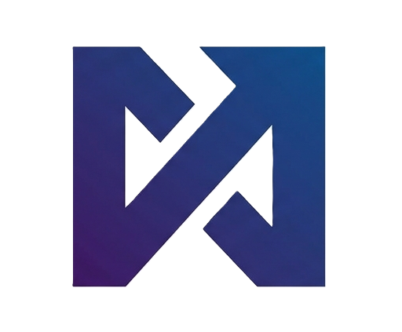

<div align="center">



# NEXORA NODE

**Earn NEXORA tokens by running a lightweight node on the Base network.**

No GPU. No heavy computation. Just run and earn.

[](https://node-production-712b.up.railway.app)
[](https://node-delta-ten.vercel.app)
[](https://basescan.org/token/0xE0a4a9d3263ee93E167196954Ea4684418911E24)
[](https://basescan.org/address/0xaeD12935DA40EFf65d919CCc4b77Df185f4A2cf0#code)
[](LICENSE)

</div>

---

## What is Nexora?

Nexora is a distributed node network where participants run lightweight CLI nodes and earn **NEXORA (NEXOR)** tokens based on uptime. The network verifies activity on the Base blockchain — every node contributes to network integrity and is rewarded proportionally.

> **Invite-only beta** — you need a referral code to join.

---

## Token

| Property | Value |
|---|---|
| Name | NEXORA NODE |
| Symbol | NEXOR |
| Network | Base Mainnet |
| Total Supply | 240,000 NEXOR (fixed, non-mintable) |
| Mining Allocation | 200,000 NEXOR |
| Reserve | 40,000 NEXOR (liquidity, dev, ecosystem) |
| Token Contract | [`0xE0a4a9d3...11E24`](https://basescan.org/token/0xE0a4a9d3263ee93E167196954Ea4684418911E24) ✅ Verified |
| Claim Contract | [`0xaeD12935...2cf0`](https://basescan.org/address/0xaeD12935DA40EFf65d919CCc4b77Df185f4A2cf0#code) ✅ Verified |

---

## Quick Start

### Requirements
- Python 3.8+
- A referral code

### 1. Install

```bash
git clone https://github.com/Nexora-Node/Node
cd Node
pip install -r requirements.txt
```

### 2. Register

```bash
cd cli
python main.py register --ref YOUR_REFERRAL_CODE
```

### 3. Start Mining

```bash
python main.py start
```

The live dashboard opens automatically. Press **Ctrl+C** to stop the node.

---

## Live Terminal Dashboard

```
====================================================================================================
                         NEXORA NODE DASHBOARD
====================================================================================================
  User: Danixyz   Node: [RUNNING]   2026-04-01 10:00:00
  Referral: TKXSZ6B4  (share to invite others)

  NEXORA BALANCE
  Available   : 111.631298 NEXORA
  Total Earned: 111.631298 NEXORA   Claimed: 0.000000 NEXORA

  MINING INFO
  Rate: 0.289352 NEXORA/min  Epoch #0  Decay in 23.4d
  Supply: [##..................] 25/200000

  NODES (1 active)
  [ON] a1b2c3d4e5f67890...  uptime 2h 15m  score 100/100

  LIVE LOG  (last 8 lines)
  [10:00:30] Node active — verifying Base network | uptime 2h 15m | score 100/100
  [10:01:00] Node active — verifying Base network | uptime 2h 16m | score 100/100

  Refresh every 5s  |  Ctrl+C to exit
```

---

## CLI Commands

| Command | Description |
|---|---|
| `python main.py register --ref CODE` | Register with a referral code |
| `python main.py start` | Start node + open live dashboard |
| `python main.py stop` | Stop running node |
| `python main.py status` | Show NEXORA balance and node info |
| `python main.py dashboard` | Open dashboard (node already running) |
| `python main.py wallet 0x...` | Link EVM wallet for on-chain claiming |
| `python main.py claim` | Instructions to claim NEXORA on web |

---

## Reward System

Nexora uses a **smooth 5% decay** model — rewards decrease gradually every 24 days, ensuring the 200,000 NEXOR mining supply lasts approximately 100 years.

```
rate(epoch) = 0.289352 × 0.95^epoch   NEXORA/min
earned      = (uptime_delta / 60) × rate × (node_score / 100)
```

| Epoch | Period | Rate | Emission |
|---|---|---|---|
| 0 | Day 0–23 | 0.2894 NEXORA/min | 10,000 NEXORA |
| 1 | Day 24–47 | 0.2749 NEXORA/min | 9,500 NEXORA |
| 2 | Day 48–71 | 0.2611 NEXORA/min | 9,025 NEXORA |
| 10 | Day 240+ | 0.1743 NEXORA/min | 6,025 NEXORA |

> Total converges to exactly **200,000 NEXORA** — mathematically guaranteed.

---

## Claiming NEXORA

1. Open [node-delta-ten.vercel.app](https://node-delta-ten.vercel.app)
2. Enter your username
3. Connect MetaMask → link your wallet
4. Click **Claim NEXORA**
5. Confirm the transaction on Base (~$0.01 gas)

NEXORA transfers directly to your wallet. A **0.05% fee** goes to the DEX listing fund.

---

## Node Score & Anti-Cheat

Every node starts at **score 100**. The system monitors for abuse while being fair to legitimate users.

| Score | Status | Reward |
|---|---|---|
| 80–100 | Healthy | 80–100% |
| 50–79 | Reduced | 50–79% |
| 20–49 | Penalized | 10–25% |
| < 20 | Suspended | 0% |

Score recovers automatically with stable uptime (+1 per hour, up to +5 per heartbeat).

---

## Blockchain Node Bonus

Running a verified local blockchain full node earns **bonus NEXORA** on top of uptime rewards.

| Network | Multiplier |
|---|---|
| ETH Mainnet | 5× |
| Base Mainnet | 3× |
| OP Mainnet | 2× |
| BNB Chain | 2× |
| Base Sepolia | 1.5× |

The server independently verifies your node's sync status against public RPCs — cannot be faked.

---

## Platform Support

| Platform | Status |
|---|---|
| Windows | ✅ |
| Linux / VPS | ✅ |
| macOS | ✅ |
| Android (Termux) | ✅ |
| Raspberry Pi | ✅ |

---

## Troubleshooting

**Node suspended?**
```bash
python main.py stop
python main.py start
```
The node will auto-reset and re-register.

**"Cannot connect to server"**
Check your internet connection. Backend: [node-production-712b.up.railway.app/health](https://node-production-712b.up.railway.app/health)

**"Maximum 2 nodes per device"**
Each device supports max 2 nodes. Stop an existing node first.

---

## Documentation

Full docs → [github.com/Nexora-Node/Docs](https://github.com/Nexora-Node/Docs)

| Doc | Link |
|---|---|
| Introduction | [introduction.md](https://github.com/Nexora-Node/Docs/blob/master/introduction.md) |
| How It Works | [how-it-works.md](https://github.com/Nexora-Node/Docs/blob/master/how-it-works.md) |
| Reward System | [rewards.md](https://github.com/Nexora-Node/Docs/blob/master/rewards.md) |
| Roadmap | [roadmap.md](https://github.com/Nexora-Node/Docs/blob/master/roadmap.md) |

---

<div align="center">

Built with ❤️ on Base · [Dashboard](https://node-delta-ten.vercel.app) · [Docs](https://github.com/Nexora-Node/Docs) · [Token](https://basescan.org/token/0xE0a4a9d3263ee93E167196954Ea4684418911E24)

</div>
